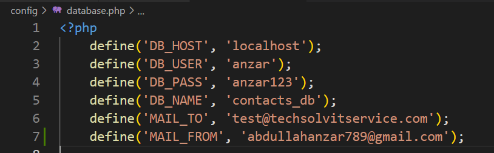
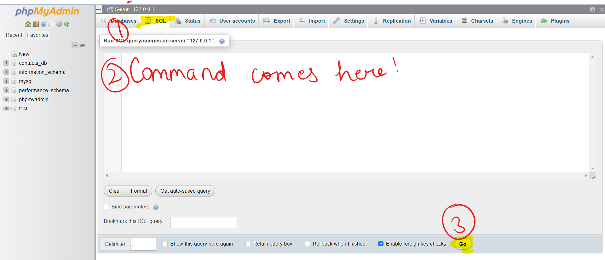
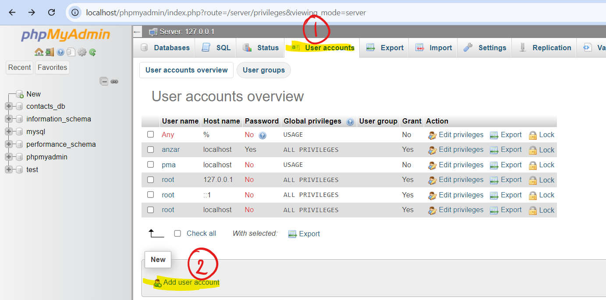
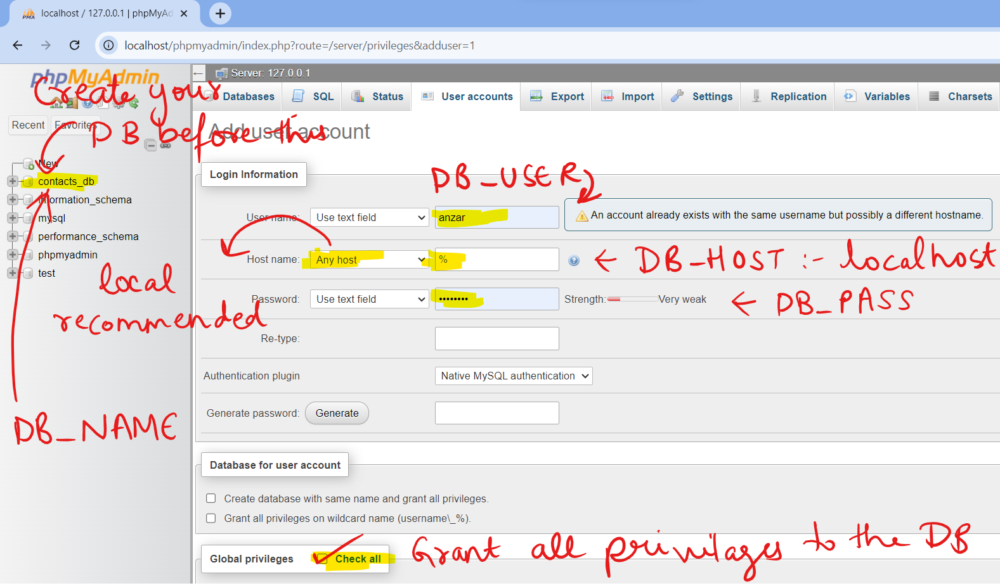

Welcome to the ContactForm repo. This is a PHP Server Side application which renders an HTML contact form for submission in the browser and then validates and submits the data in the backend to the database. It also sends a mail to the host acknowledging the same.

You can get started with this project using the following steps:

1. Clone the repository to your local machine. Copy it to your htdocs folder if you are using XAMPP.

2. Go to config/database.php file.
   

   You may see some text like this.

3. Please edit these to your local or server configurations:

   | CONFIGURATIONS | RELATED SETTINGS                                                                                     |
   | -------------- | ---------------------------------------------------------------------------------------------------- |
   | 'DB_HOST'      | Your localhost or server's host.                                                                     |
   | 'DB_USER'      | You may need to create a user with read and write privilages in your mySQL Database.                 |
   | 'DB_PASS'      | You must provide the password for the above user. Refer to the last point for help regarding the same. |
   | 'DB_NAME'      | The name of the mySQL database that you may have created. I have set the default name as contacts_db. |
   | 'MAIL_TO'      | The email address where you want the email to be sent on successful form submission. |
   | 'MAIL_FROM'    | The email address you have set in your SMTP XAMPP configuration. Other email addresses may lead to unexpected behavior. |  

4. Please note the database should contain a table named contact_form with the following command / columns:

   `CREATE TABLE contact_form (
    id INT AUTO_INCREMENT PRIMARY KEY,
    name VARCHAR(255) NOT NULL,
    phone VARCHAR(255) NOT NULL,
    email VARCHAR(255) UNIQUE,
    subject VARCHAR(255) NOT NULL,
    message TEXT NOT NULL,
    ip_address VARCHAR(18) NOT NULL,
    timestamp VARCHAR(255)
    );`

   You may copy/paste and run the above mySQL command in localhost/phpmyadmin > SQL, like:
   

5. **For the mail to be sent successfully, you must have SMTP setup successfully on your local machine or server failing which there may be a handled exception. This is required as only corePHP is allowed in the project, so
   secure external libraries PHPMailer, etc. could not be used.**

6. The viewable address/url may look something like this on Windows with XAMPP:
   `localhost/ContactForm/`

7. You can set up the user using the following steps:
   a. Go to localhost/phpmyadmin . This assumes you have XAMPP installed and working on Windows. You can create a new empty database from phpmyadmin if you already haven't. 
      Click on 1 and then 2 as shown in the image below:
      
   b. Give the repective values as shown in the picture below, scroll down and hit GO! 
      

ENJOY!